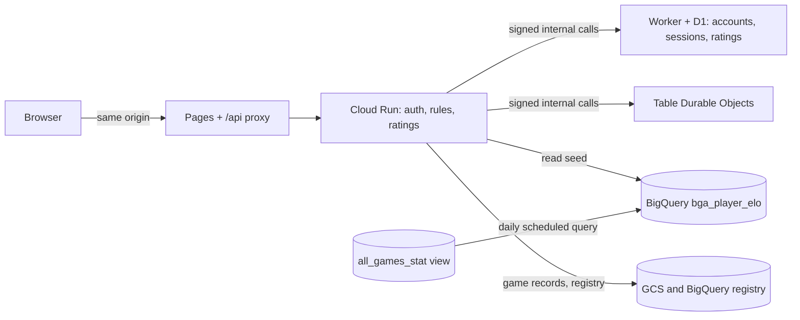

# Accounts and Ratings Plan

Players create an account with a username and a password. A username that exists on BGA copies that player's last Elo once. Live games can be rated or friendly, and a tracker keeps the results of the mini games and puzzles to come.

Status: plan, nothing implemented. Copy of the published page https://claude.ai/artifact/8SfrhQPiL73cpkVdNm8oM3 (this file is the one to keep up to date). Written 2026-10-10 for the engineers who will build it.

## Decisions

| Topic | Decision | Status |
| --- | --- | --- |
| Account identity | Username and password only. No email. | Decided |
| Account id | The BGA player id when the username matches a BGA player. If the name belongs to several BGA ids, the user picks theirs from a list. A username that is completely new gets `P{n}`, where `n` is an incrementing integer (`P1`, `P2`, ...). BGA ids are plain digits, so the two kinds never collide. | Decided |
| BGA Elo copy | One time, at signup, when the username matches a BGA player in the BigQuery index (case-insensitive). The value is the player's latest `post_match_elo`. No match: the rating starts at 0. | Decided |
| Name with several BGA ids | Signup lists every BGA id that shares the username (with its last game, game count and Elo) and asks the user to pick their own. A warning says the chosen player id will be used to set their starting Elo. | Decided |
| BGA id already taken | If an account already holds a BGA id (BGA renames: 84,416 names share 84,347 ids), it can't be picked again, because the Elo copy happens once per BGA player. A user who has no free id left becomes a new player with a `P{n}` id. | Proposed |
| Ownership of a BGA name | Not verified. Anyone can register a BGA name first. Seeded ratings are labelled "seeded from BGA". | Decided |
| Rated and friendly | The table creation step offers Rated or Friendly. Anonymous users can only play Friendly. | Decided |
| Rating formula | Elo with K=20, the same K that BGA uses. | Decided |
| Password recovery | No email, so a one-time recovery code is shown at signup. | Decided |
| Mini games | A generic result tracker. Game details come later. | Details pending |

## What the existing data gives us

- **BGA index.** The BigQuery view `freestyle-190711.ark_nova.all_games_stat` has one row per player per game, with `player` (username), `player_id`, `pre_match_elo`, `post_match_elo`, `elo_delta`, `post_match_arena_rating` and `game_ended_at`. It holds about 6.1 million rows, 84,416 distinct usernames, and no two usernames collide when lowercased.
- **One name, several ids.** A name can map to more than one BGA id (for example "Eagles Gaming" has 3). Signup shows all of them and the user picks theirs (see signup).
- **Query cost.** A lookup scans about 370 MB of the view. That is cheap per query but too slow for a signup page, so we precompute (see the architecture).
- **Live games today.** Cloud Run applies the rules, the Cloudflare keeper (a Worker with a Durable Object per game) orders the moves, and a finished game is written to the BigQuery registry (`live_table_events`) and to GCS. Players are identified by secret seat tokens and free-text names. The keeper is called with signed internal routes (`X-Signature` of `INTERNAL_SECRET`).
- **Site layout.** The static site is on Cloudflare Pages (`ark-nova.pages.dev`) and its Function proxies `/api/*` to Cloud Run, so session cookies stay same-origin. Rate limiting exists in `api/ratelimit.py` but is off unless `RATE_LIMIT_ENABLED` is set.

## Architecture



- **Account store: Cloudflare D1 (SQLite)**, reached only through signed internal Worker routes, like the keeper. Usernames need a unique constraint and consistent writes, which BigQuery and stateless Cloud Run cannot give.
- **Password hashing on Cloud Run** with argon2id. The Worker stores and returns hashes and never computes them.
- **Sessions:** a random token, stored hashed, in an HttpOnly, Secure, SameSite=Lax cookie with a 30 day sliding expiry. State-changing routes also check the `Origin` header.
- **Seed table:** `bga_player_elo(player_lower, bga_player_id, player, elo, arena_rating, games, last_game_at, as_of)`, one row per (name, BGA id), rebuilt daily from the view by a BigQuery scheduled query. Signup reads the few rows of one name.
- **The engine is not involved.** Ratings are computed by the live service when a game ends, so `ENGINE_VERSION` does not change and no live table is abandoned.

## Data model

### D1 tables

| Table | Columns | Notes |
| --- | --- | --- |
| `accounts` | id (text, primary key: a BGA player id such as `89107474` or `P12`), id\_source (`bga` or `new`), username, username\_lower (unique), password\_hash, recovery\_hash, created\_at, last\_login\_at, bga\_elo\_seed, rating (real), rated\_games, rated\_wins | `rating` starts at the seed or 0. `bga_elo_seed` is written once and never changes. The id never changes, even if the username does later. |
| `counters` | name (pk), value | One row, `account_p`, the last `P` number. It is incremented in the same D1 batch that inserts the account, so two signups never get the same id. |
| `sessions` | token\_hash (pk), account\_id (text), created\_at, expires\_at, user\_agent | Logging out or changing the password deletes rows. |
| `rating_history` | game\_id, account\_id, seat, opponent\_id, result (1, 0.5, 0), rating\_before, rating\_after, delta, k, at | Unique on (game\_id, account\_id): this makes the update idempotent. |
| `minigame_results` | id, game\_key, account\_id (text, nullable), puzzle\_id, score, duration\_ms, details (JSON), verified, client\_version, played\_at | See the mini games section. |

### Live game records

The registry events and the game record gain: `rated` (bool), `account_ids` (per seat, text: a BGA id or `P{n}`, null for guests), and `rating_before/after` per seat. The BigQuery registry is append only, so the change is new nullable columns plus an update of `scripts/setup_live_registry.py` and the `live_tables` view.

## Signup and the BGA Elo copy

1. Username: 3 to 24 characters, letters, digits, space, `_` `-` `.`; Unicode normalized (NFKC); unique ignoring case; a reserved list (admin, system, bot names) is refused.
2. Password: at least 10 characters, checked against a common-passwords list, hashed with argon2id.
3. Check step, before the account exists: `POST /api/auth/check` with the username returns what the form must show.
   - **No BGA match, a completely new name:** nothing to choose. The account will get the next `P{n}` id and start at rating 0.
   - **One BGA id matches:** the form shows that id with its last game date, game count and Elo.
   - **Several BGA ids share the name:** the form lists all of them, each with last game date, game count and Elo, and the user must pick theirs. An id that already has an account is shown as unavailable. The list also offers "None of these, I am a new player" (`P{n}` id, rating 0).Whenever there is a match, the form warns before the user can continue: *"The BGA player id you choose will be used to set your starting Elo. This is done once and cannot be changed afterwards."*
4. Register: `POST /api/auth/register` with the username, password and, when there was a match, the chosen `bga_player_id`. The server checks the id is one of the ids of that name and is not held by another account; it does not trust the form.
   - **BGA id chosen:** the account id is that BGA player id (as text), `id_source = bga`, and `rating = bga_elo_seed = post_match_elo` of that id's latest game.
   - **None of these, or no match:** the next `P{n}` id (the counter row is incremented in the same batch as the insert), `id_source = new`, rating 0.
   - **The id was taken between the check and the register call:** the call fails and the form asks again.
5. The response shows the recovery code once. Only its hash is stored.
6. The profile marks a seeded rating as "seeded from BGA, not verified".

**Note.** **Known risk.** Because ownership is not checked, someone can register another person's BGA name first and take that rating. We accept this for now. Because the account id is the BGA player id, a later verification step, a reset, or a merge with BGA history needs no migration: BGA games and our games already share the id.

## Rated and friendly games

- **Creation.** The table creation step shows a Rated / Friendly choice. Rated is only selectable when the creator is logged in. Anonymous creators get Friendly and nothing else.
- **Seats.** Seat tokens stay the authority for moves. A seat is linked to an account when its holder joins while logged in. A Rated table starts only when both seats are linked to two different accounts. A guest who opens a Rated seat link is asked to log in or sign up first.
- **Names.** Seats linked to an account use the username as the player name.
- **Friendly games** behave as today. Logged-in players may still link their account, which only affects their game list.
- **The flag is fixed** when the table is created. It is stored in the keeper config and the registry rows, and cannot be changed afterwards.

## Rating formula

```
expected(A) = 1 / (1 + 10 ** ((rating_B - rating_A) / 400))
rating_A'   = rating_A + 20 * (score_A - expected(A))        # K = 20, like BGA
score: win 1, draw 0.5, loss 0
```

- **Updated once,** when the game ends, in the same step that archives the record. The unique key on `rating_history` protects against a repeat.
- **A concession or running out of time counts as a loss.** Ties follow the game's own tie-break; a game with no winner after the tie-break scores 0.5 each.
- **Unrated:** friendly games, games ended by agreement, cancelled games, and (open) games that end before a minimum number of turns.
- **Check against BGA first.** The BigQuery view has `pre_match_elo`, `post_match_elo` and `elo_delta` for 6.1 million player-games. Before building, recompute a sample with this formula and confirm it matches BGA's own deltas. If BGA's number is shifted or scaled, adjust the formula or the seed so the copied Elo and ours stay on one scale.

## Mini games and puzzles

The details come later, so the tracker is generic. Anything a game needs beyond these fields goes in `details`.

- **Games registry:** a small file listing each `game_key`, its name, whether a higher or lower score is better, and whether the server can verify a result.
- **Submission:** `POST /api/minigames/{key}/results` with puzzle id or seed, score, duration and details. The session decides the account. Guests may submit; the result is stored with a guest id and can be attached to an account after login.
- **Verification:** where the puzzle is generated from a seed, the server replays or checks the submitted solution and sets `verified = true`. Unverified results stay private to the player and out of public leaderboards.
- **Views:** a player's history, best score, streak, and a leaderboard per game and per puzzle.

## API and pages

| Route | Purpose |
| --- | --- |
| `POST /api/auth/check` | Given a username: free or taken, and the BGA ids that match it (id, last game, games, Elo, available or not). Rate limited like register. |
| `POST /api/auth/register` | Create the account with the chosen BGA id (or a `P{n}` id), seed the rating, return the recovery code once, set the cookie. |
| `POST /api/auth/login`, `/logout`, `/recover` | Session start and end; recovery with the code sets a new password and a new code. |
| `GET /api/auth/me` | The logged-in account (username, rating, seed label) or 401. |
| `GET /api/players/{id}` | Public profile by account id (BGA id or `P{n}`); a name lookup redirects to the id. Rating, rated games, recent rated results. |
| `GET /api/leaderboard` | Top ratings (accounts with at least a few rated games). |
| `POST /api/games` (extended) | Gets `rated`; refused for guests when true. |
| `POST /api/games/{id}/join` (extended) | Links the logged-in account to the seat. |
| `POST /api/minigames/{key}/results`, `GET /api/minigames/{key}/leaderboard` | Mini game tracker. |

Pages: a login and signup dialog and a user menu in the site header (every page that shares the layout), a profile page, a leaderboard page, the Rated / Friendly choice in the live lobby (`web/play.html`), the rating change on the end page (`web/end.html`), and later the mini game pages.

## Security and housekeeping

- Turn the rate limiter on for `/api/auth/*` with tight limits per client, and put Cloudflare Turnstile on signup.
- Never log passwords, hashes, recovery codes or session tokens.
- Login errors do not say whether the username exists. Compare hashes in constant time.
- Account deletion keeps the games and rating history but replaces the name with "deleted player".
- A short terms and privacy page: what is stored (username, password hash, ratings, results) and that no email is collected.

## Work packages

### A. Foundation (Medium)

*Needs: nothing. Touches: `cloudflare/`, `src/ark_nova/accounts/`, `api/`, `web/`.*

- D1 database and migrations (`accounts`, `counters`, `sessions`); signed internal Worker routes for accounts and sessions; id allocation (BGA id or the next `P{n}`) in one D1 batch.
- Python `AccountService` (argon2id, sessions, recovery code) and the `/api/auth/*` routes.
- Rate limiting and Turnstile on signup; header login widget; tests (service with an in-memory twin like `FakeKeeper`, routes, Worker tests).
- Deploys: Worker, Cloud Run, Pages.

### B. BGA Elo seed (Small)

*Needs: A. Touches: BigQuery, `scripts/`, `AccountService`.*

- Create `bga_player_elo` (with `bga_player_id`) and its daily scheduled query; expose every id of a name for the check step.
- Check step and register with the chosen BGA id, the warning text and the picker (one, several, none of these), taken-id fallback, `P{n}`; profile shows the seed label.
- Validate the Elo formula against `elo_delta` on a sample (see the rating section).

### C. Rated and friendly games (Large)

*Needs: A, B. Touches: `live/service.py`, `api/live.py`, `live/registry.py`, the keeper config, `web/play.html`, `web/js/play.js`.*

- Rated / Friendly choice at creation; guests limited to Friendly.
- Seat to account linking at join; start condition for rated tables.
- Rating update at game end, idempotent; registry columns and view update.
- Leaderboard and profile pages; rating change on the end page.
- Tests: two logged-in clients play a rated game against `FakeKeeper`, concession and timeout cases, a repeated end event changes nothing.

### D. Mini game tracker (After details)

*Needs: A. Touches: D1 migration, `api/`, new pages.*

- Results table, games registry file, submit and leaderboard routes.
- Per game verification once the games are defined.

## Still open

| Question | Suggested default |
| --- | --- |
| Minimum number of turns for a game to be rated | Pick one with the first real games; start without a minimum except for concessions in the first two turns. |
| Who may see the leaderboard, and how many rated games before listing | Everyone, after 5 rated games. |
| A user who picks "None of these" while a matching BGA id exists: allowed, or require a pick | Allowed (they may be a different person with the same name); they start at 0. |
| Rating shown as an integer or with decimals | Stored as a real number, shown as an integer. |
| Mini games: kinds, scoring, verification, anonymous play | Waiting for the details. |
| Custom domain | `engine.emufriends.pet` is attached to the Pages project; cookies are per host, so choose the final host before launch. |
