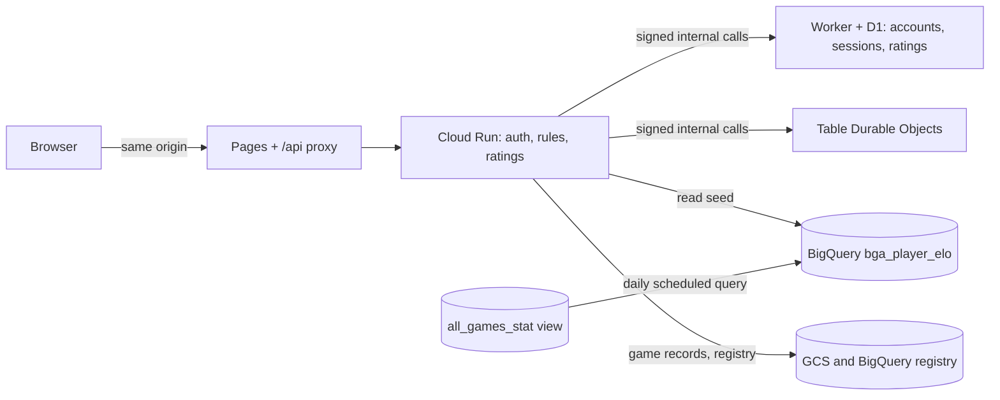

# Accounts and Ratings Plan

Players create an account with a username and a password. A username that exists on BGA copies that player's last Elo once. Live games can be rated or friendly, and a tracker keeps the results of the mini games and puzzles to come.

Status: plan, nothing implemented. Copy of the published page https://claude.ai/artifact/8SfrhQPiL73cpkVdNm8oM3 (this file is the one to keep up to date). Written 2026-10-10 for the engineers who will build it.

## Decisions

| Topic | Decision | Status |
| --- | --- | --- |
| Account identity | Username and password only. No email. | Decided |
| Account id | The BGA player id when the username matches a BGA player. If the name belongs to several BGA ids, the user picks theirs from a list. A username that is completely new gets `P{n}`, where `n` is an incrementing integer (`P1`, `P2`, ...). BGA ids are plain digits, so the two kinds never collide. | Decided |
| BGA Elo copy | One time, at signup, when the username matches a BGA player in the BigQuery index (case-insensitive). The value is the player's latest `post_match_elo`. No match: the rating starts at 0. | Decided |
| Name with several BGA ids | Signup lists every BGA id that shares the username (with its last game, game count and Elo) and asks the user to pick their own. A warning says the chosen player id will be used to set their starting Elo. | Decided |
| BGA id already taken | If an account already holds a BGA id (BGA renames: 84,416 names share 84,347 ids), it can't be picked again, because the Elo copy happens once per BGA player. A user who has no free id left becomes a new player with a `P{n}` id. | Proposed |
| Ownership of a BGA name | Not verified. Anyone can register a BGA name first. Seeded ratings are labelled "seeded from BGA". | Decided |
| Rated and friendly | The table creation step offers Rated or Friendly. Anonymous users can only play Friendly. | Decided |
| Rating formula | Elo with K=20, the same K that BGA uses. | Decided |
| Password recovery | No email, so a one-time recovery code is shown at signup. | Decided |
| Mini games | Two daily games, each isolated in its own folder behind one contract: Daily starting hand and Who's ahead. Separate scores and leaderboards (all time and monthly). | Decided, a few details open |

## What the existing data gives us

- **BGA index.** The BigQuery view `freestyle-190711.ark_nova.all_games_stat` has one row per player per game, with `player` (username), `player_id`, `pre_match_elo`, `post_match_elo`, `elo_delta`, `post_match_arena_rating` and `game_ended_at`. It holds about 6.1 million rows, 84,416 distinct usernames, and no two usernames collide when lowercased.
- **One name, several ids.** A name can map to more than one BGA id (for example "Eagles Gaming" has 3). Signup shows all of them and the user picks theirs (see signup).
- **Query cost.** A lookup scans about 370 MB of the view. That is cheap per query but too slow for a signup page, so we precompute (see the architecture).
- **Live games today.** Cloud Run applies the rules, the Cloudflare keeper (a Worker with a Durable Object per game) orders the moves, and a finished game is written to the BigQuery registry (`live_table_events`) and to GCS. Players are identified by secret seat tokens and free-text names. The keeper is called with signed internal routes (`X-Signature` of `INTERNAL_SECRET`).
- **Site layout.** The static site is on Cloudflare Pages (`ark-nova.pages.dev`) and its Function proxies `/api/*` to Cloud Run, so session cookies stay same-origin. Rate limiting exists in `api/ratelimit.py` but is off unless `RATE_LIMIT_ENABLED` is set.

## Architecture



- **Account store: Cloudflare D1 (SQLite)**, reached only through signed internal Worker routes, like the keeper. Usernames need a unique constraint and consistent writes, which BigQuery and stateless Cloud Run cannot give.
- **Password hashing on Cloud Run** with argon2id. The Worker stores and returns hashes and never computes them.
- **Sessions:** a random token, stored hashed, in an HttpOnly, Secure, SameSite=Lax cookie with a 30 day sliding expiry. State-changing routes also check the `Origin` header.
- **Seed table:** `bga_player_elo(player_lower, bga_player_id, player, elo, arena_rating, games, last_game_at, as_of)`, one row per (name, BGA id), rebuilt daily from the view by a BigQuery scheduled query. Signup reads the few rows of one name.
- **The engine is not involved.** Ratings are computed by the live service when a game ends, so `ENGINE_VERSION` does not change and no live table is abandoned.

## Data model

### D1 tables

| Table | Columns | Notes |
| --- | --- | --- |
| `accounts` | id (text, primary key: a BGA player id such as `89107474` or `P12`), id\_source (`bga` or `new`), username, username\_lower (unique), password\_hash, recovery\_hash, created\_at, last\_login\_at, bga\_elo\_seed, rating (real), rated\_games, rated\_wins | `rating` starts at the seed or 0. `bga_elo_seed` is written once and never changes. The id never changes, even if the username does later. |
| `counters` | name (pk), value | One row, `account_p`, the last `P` number. It is incremented in the same D1 batch that inserts the account, so two signups never get the same id. |
| `sessions` | token\_hash (pk), account\_id (text), created\_at, expires\_at, user\_agent | Logging out or changing the password deletes rows. |
| `rating_history` | game\_id, account\_id, seat, opponent\_id, result (1, 0.5, 0), rating\_before, rating\_after, delta, k, at | Unique on (game\_id, account\_id): this makes the update idempotent. |

### Live game records

The registry events and the game record gain: `rated` (bool), `account_ids` (per seat, text: a BGA id or `P{n}`, null for guests), and `rating_before/after` per seat. The BigQuery registry is append only, so the change is new nullable columns plus an update of `scripts/setup_live_registry.py` and the `live_tables` view.

## Signup and the BGA Elo copy

1. Username: 3 to 24 characters, letters, digits, space, `_` `-` `.`; Unicode normalized (NFKC); unique ignoring case; a reserved list (admin, system, bot names) is refused.
2. Password: at least 10 characters, checked against a common-passwords list, hashed with argon2id.
3. Check step, before the account exists: `POST /api/auth/check` with the username returns what the form must show.
   - **No BGA match, a completely new name:** nothing to choose. The account will get the next `P{n}` id and start at rating 0.
   - **One BGA id matches:** the form shows that id with its last game date, game count and Elo.
   - **Several BGA ids share the name:** the form lists all of them, each with last game date, game count and Elo, and the user must pick theirs. An id that already has an account is shown as unavailable. The list also offers "None of these, I am a new player" (`P{n}` id, rating 0).Whenever there is a match, the form warns before the user can continue: *"The BGA player id you choose will be used to set your starting Elo. This is done once and cannot be changed afterwards."*
4. Register: `POST /api/auth/register` with the username, password and, when there was a match, the chosen `bga_player_id`. The server checks the id is one of the ids of that name and is not held by another account; it does not trust the form.
   - **BGA id chosen:** the account id is that BGA player id (as text), `id_source = bga`, and `rating = bga_elo_seed = post_match_elo` of that id's latest game.
   - **None of these, or no match:** the next `P{n}` id (the counter row is incremented in the same batch as the insert), `id_source = new`, rating 0.
   - **The id was taken between the check and the register call:** the call fails and the form asks again.
5. The response shows the recovery code once. Only its hash is stored.
6. The profile marks a seeded rating as "seeded from BGA, not verified".

**Note.** **Known risk.** Because ownership is not checked, someone can register another person's BGA name first and take that rating. We accept this for now. Because the account id is the BGA player id, a later verification step, a reset, or a merge with BGA history needs no migration: BGA games and our games already share the id.

## Rated and friendly games

- **Creation.** The table creation step shows a Rated / Friendly choice. Rated is only selectable when the creator is logged in. Anonymous creators get Friendly and nothing else.
- **Seats.** Seat tokens stay the authority for moves. A seat is linked to an account when its holder joins while logged in. A Rated table starts only when both seats are linked to two different accounts. A guest who opens a Rated seat link is asked to log in or sign up first.
- **Names.** Seats linked to an account use the username as the player name.
- **Friendly games** behave as today. Logged-in players may still link their account, which only affects their game list.
- **The flag is fixed** when the table is created. It is stored in the keeper config and the registry rows, and cannot be changed afterwards.

## Rating formula

```
expected(A) = 1 / (1 + 10 ** ((rating_B - rating_A) / 400))
rating_A'   = rating_A + 20 * (score_A - expected(A))        # K = 20, like BGA
score: win 1, draw 0.5, loss 0
```

- **Updated once,** when the game ends, in the same step that archives the record. The unique key on `rating_history` protects against a repeat.
- **A concession or running out of time counts as a loss.** Ties follow the game's own tie-break; a game with no winner after the tie-break scores 0.5 each.
- **Unrated:** friendly games, games ended by agreement, cancelled games, and (open) games that end before a minimum number of turns.
- **Check against BGA first.** The BigQuery view has `pre_match_elo`, `post_match_elo` and `elo_delta` for 6.1 million player-games. Before building, recompute a sample with this formula and confirm it matches BGA's own deltas. If BGA's number is shifted or scaled, adjust the formula or the seed so the copied Elo and ours stay on one scale.

## Mini games and puzzles

Two daily mini games to start, more later: **Daily starting hand** and **Who's ahead**. They are built so a game can be added, tested alone and removed without touching the others. Both play on real finished tables from the BGA index, with the replay viewer's look, but with everything that would give the answer away removed.

### Isolation rules

- **One folder per game.** Server code in `src/ark_nova/minigames/<key>/`, page code in `web/minigames/<key>/`, tests in `tests/minigames/<key>/`. A game never imports another game. A test fails if it does.
- **A small platform in between** (`src/ark_nova/minigames/platform/`): the registry, the daily rollover, the puzzle and submission stores, the leaderboard queries, the shared redaction checks and the shared page shell (login prompt, anonymous choice, leaderboard widget). The platform only knows games through the contract below.
- **A manifest decides what exists:** `data_manual/minigames.json`, a list of `{key, enabled, title, blurb, allow_past}`. `allow_past` is false by default; Who's ahead sets it to true (see the calendar below). Disabled or missing means: no routes (404), no tile on the hub, no rollover. Removing a game is deleting its three folders and its manifest line. `scripts/minigames_purge.py <key>` deletes its stored puzzles, submissions and aggregates (every stored row carries `game_key`).
- **The contract** (a Python `Protocol`; every game implements all of it):

| Method | What it does |
|---|---|
| `key`, `title`, `leaderboard` | Identity and the leaderboard definition: the metric, whether higher or lower is better, the minimum plays to be listed. |
| `pick_moment(ctx, source)` | Given the table the picker chose, returns the **moment** of the puzzle: a small JSON pointer such as `{seat, move_id}`. Nothing else is stored. |
| `build_public(moment, log)` | Builds from the log what the browser may see (the redacted state at that moment). Deterministic: the same moment and builder version give the same result. |
| `answer(moment, log)` | Derives the answer from the log (the original player's picks, the real winner). It is never stored and never sent before the player submits. |
| `validate(public, payload)` | Checks a submission (shape, counts, sums) and returns clean data or errors. |
| `score(answer, payload)` | Returns the score value and a detail object. |
| `reveal(public, answer, payload, day_stats)` | What the player sees after submitting. |
| `day_stats(submissions)` | The community numbers of the day (pick rates, average prediction). |

- **Shared stores, game-private contents.** They live in the same D1 database as the accounts, reached through the same signed Worker routes. Tables are keyed by `game_key` and keep the game's own data in JSON columns, so a new game needs no migration:
  - `minigame_puzzles(game_key, day, source_ref, moment, builder_version, public_cache, created_at)`, unique on (game_key, day). `source_ref` is the BGA table id and `moment` the pointer (for example `{seat, move_id}`, using BGA's `move_id`, which does not change when our replay builder does). **The pointer is the truth; `public_cache` is only a cache** of the built payload, filled at rollover so the first player of the day does not wait for a replay build, and rebuilt whenever `builder_version` differs from the current one. Nothing derived from the log, such as the answer, is stored. `source_ref` is not sent to a browser until the player has submitted: it is part of the reveal.
  - `minigame_used_sources(game_key, source_ref)`, unique. This is the "never picked before" memory, kept per game.
  - `minigame_submissions(id, game_key, day, account_id, anon_id, payload, score, detail, submitted_at)`, unique on (game_key, day, account_id) and on (game_key, day, anon_id).
- **Tested alone.** The platform ships fakes: `FakeClock`, `FakeSourceIndex` (a list of candidate tables), `FakeLogs`, in-memory stores. `tests/minigames/test_contract.py` runs one contract suite against every registered game. It checks that the same moment always rebuilds the same payload, that `public` never holds a name, player id, table id or timestamp, that the answer and the table id are absent before submission and present in the reveal, that a second submission is refused, that a past day is refused unless the game has `allow_past`, and accepted once when it has, that scoring is deterministic, and that a game with a failing rollover does not stop the others. A "remove one game" test checks the other games still work.
- **One viewer mode, no copies.** Both games use the replay viewer through a `window.MINIGAME_MODE` flag (like `PLAY`, `FORK`, `SANDBOX`). The per-game page passes a small config (`redactNames`, `showElo`, `hidePovSwitch`, `noStepping`, `hideLog`) and one state object. The viewer code is not forked.

### Daily rollover and picking the table

- **The day is the UTC date.** A Cloudflare Cron Trigger at 00:00 UTC calls a signed internal route on Cloud Run (`POST /internal/minigames/rollover`). For each enabled game, in its own try/except, it creates that day's puzzle. The insert is unique on (game_key, day), so a repeat is harmless.
- **Lazy fallback.** If a request finds no puzzle for today, it creates it then. A missed cron never breaks a game.
- **The picker query is the game's own file:** `data_manual/minigames/<key>.sql`, which you will edit. For now both use: a table with a log in `logs_archive_mapping`, two players, not in `minigame_used_sources` for that game. Pick one at random. The query also returns both players' `pre_match_elo` for that table.
- **Elo shown is the BGA Elo before that table** (`pre_match_elo`), rounded.

### What the browser may receive (both games)

- One state object for one moment of the game. Not the replay, no step list, no later steps.
- No player names, ids, table id, date or log lines. The Log tab is hidden or replaced by the puzzle instructions. Players are shown as "Player 1" and "Player 2" with their Elo.
- The original player's choices, the final result and the **BGA table id** only come back in the reply to a valid submission. Showing the table id earlier would let a player look the game up.
- Card images are served by card key, so image URLs do not leak the table.

### Game 1: Daily starting hand (`daily_hand`)

- **Puzzle:** a random seat of the table. The state is the moment just before that player's initial selection: their dealt hand (8 cards, 9 on map 14 where the person sponsor is found right after the deal), their two endgame cards, their map and everything public. The opponent's hand is not shown.
- **Task:** choose the cards to keep: 4 (5 on map 14). The count comes from the log (hand size minus the 4 discards), not from a constant. The player confirms once.
- **Not logged in:** show "You can create an account to save your results and compete in a monthly leaderboard, or submit your prediction anonymously." Anonymous submission is allowed.
- **Reveal:** the original player's selection, with each match marked, and the **BGA table id** the puzzle came from (see "The table id in the reveal"). **Score = the number of matching cards** (0 to 4, or 0 to 5).
- **Pick rates:** for every card in the hand, the share of everyone who played that day so far (anonymous players included) who kept it. Shown after submitting, with the count of players.
- **Leaderboard metric:** the sum of points, higher is better.

### Game 2: Who's ahead (`whos_ahead`)

- **Puzzle:** a moment in the middle of the table, with both players fully visible: boards, hands, endgame cards, tracks and everything public. The deck and discard pile are not shown (only their sizes). Names hidden, Elo shown.
- **Which moment is open** (see the questions). Proposal: a random turn between the second break and the end-of-game trigger, chosen when the puzzle is built and stored.
- **Task:** enter a win percentage for each player and, optionally, a tie percentage. They must add up to 100 (whole numbers). The form shows the running total, disables Submit until it is 100, and the server checks again.
- **Not logged in:** the login prompt appears when they submit, with the choice to submit anonymously.
- **Score: Brier score** of the three outcomes (player 1 wins, player 2 wins, tie), with `p` the entered probabilities as fractions and `o` the real outcome as 1 for the real result and 0 for the others:

```
brier = (p1 - o1)^2 + (p2 - o2)^2 + (pt - ot)^2        # 0 is perfect, 2 is the worst
```

  A 50/50 guess with no tie scores 0.5 when someone wins. Lower is better.
- **Reveal:** the real result and final scores, the player's Brier score, the average prediction of that puzzle, and the **BGA table id** (see "The table id in the reveal").
- **Past issues:** every earlier puzzle can be played from a calendar (see "Past issues of Who's ahead"). Daily starting hand does not have this: it stays today only.
- **Leaderboard metric:** the mean Brier score over the games played, lower is better, with a minimum number of plays to be listed (3 for the month, 10 for all time).

### Leaderboards

- Each game has its own scores and its own two boards: **all time** and **current month**. Nothing is shared between games.
- **The month is the UTC month in which the submission is made** (`YYYY-MM`). For today's puzzle this is the puzzle's own month. A past issue played later counts in the month it is played, so a closed month never changes. The monthly board "resets" at exactly 00:00 UTC on the 1st because the month key changes. No reset job exists. Older months stay stored, so a "past months" page can be added.
- Only logged-in accounts are ranked. Anonymous submissions are scored and shown to the player, and count in the day's community numbers, but are not on a leaderboard.
- One submission per game per day for an account, and one per anonymous browser (an anonymous id cookie, so it can be bypassed; it is a convenience limit).
- A submission is accepted only for the puzzle of the current UTC day, until 00:00 UTC. The one exception is a game with `allow_past`, which also accepts any earlier day that has a puzzle.

### Routes and pages

| Route | Purpose |
|---|---|
| `GET /api/minigames` | The enabled games and, for the caller, whether today's puzzle is played. |
| `GET /api/minigames/{key}/today` | Today's `public` payload, or the player's own result if already played. |
| `GET /api/minigames/{key}/puzzle/{day}` | The same for one day (`YYYY-MM-DD`). Only for games with `allow_past`; for the others only today's day answers. |
| `GET /api/minigames/{key}/days?month=YYYY-MM` | For the calendar: each day of the month that has a puzzle, with `played` and the caller's score. Only for games with `allow_past`. |
| `POST /api/minigames/{key}/submit` | One submission for a `day` (account, or anonymous with `anon_id`). Returns the reveal. |
| `GET /api/minigames/{key}/leaderboard?period=all\|month` | The board of that game. |
| `POST /internal/minigames/rollover` | Signed, called by the cron trigger. |

Pages: one **Mini games hub** (`web/minigames/index.html`), one page per game (`web/minigames/<key>.html`), and the shared shell (login prompt, anonymous choice, leaderboard). See "Finding the games" below.

### The table id in the reveal

- After a valid submission, both games show **the BGA table id** of the puzzle with two links: the table on BGA, and our own replay page for that table (`/replay.html?table=<id>`, which works because the picker only chooses tables we have a log for).
- It is shown only in the reveal, never before, so nobody can look the game up first. For Who's ahead past issues, a player sees the table id only after submitting that issue too.
- The table id is stored in `source_ref` and read by the reveal; no other part of the puzzle payload carries it.

### Past issues of Who's ahead (calendar)

- The game page has a **calendar**. Each day that has a puzzle is a selectable cell: played days show the player's Brier score, unplayed days are marked, days without a puzzle (before the game started, or a missed day) and future days are disabled. Today is selected by default.
- It is generic, not special to this game: the platform's shell draws the calendar for any game whose manifest line has `allow_past: true`, from `GET /api/minigames/{key}/days`. Daily starting hand does not set the flag and shows no calendar.
- A past issue is played exactly like today's. Same rules: one submission per player per day, anonymous play allowed, answer and table id revealed after the submission.
- A past issue counts on the leaderboards like any other play (all time, and the month in which it is played).
- Community numbers (the average prediction) are per puzzle and include every submission to it, whenever it was made.
- Optional: `scripts/minigames_backfill.py whos_ahead --days 30` creates puzzles for earlier days, so a new game starts with a library instead of an empty calendar. It uses the same picker and the same "never picked before" memory.

### Finding the games: start page and hub

- **The start page** (`web/index.html`) gets one card, "Mini games", next to the existing cards (replay, sandbox, live, map editor). It always shows, even when only one game is enabled.
- **The card links to the hub** (`web/minigames/index.html`). The hub lists every enabled game as a tile: its title, a one-line description, and for the logged-in or anonymous visitor whether today's puzzle is played (and the score if so). Each tile links to that game's page. After the last tile there is a quiet tile that says **"More mini games coming soon"**.
- **The hub is built from the data, not edited by hand.** It reads `GET /api/minigames`, which returns the enabled games from the manifest with their `title`, `blurb` and today's status. Adding a game adds its tile, removing a game removes it, and neither touches the hub or the start page. The manifest line carries `title` and `blurb`, so the hub can list a game without loading its code.
- **Coming-soon tile** is fixed text in the hub page, not a game. It is the same whether zero, one or many games exist.
- **Navigation:** each game page has a "Mini games" link back to the hub, and the hub links back to the start page.
- **Tests:** the platform test renders the hub against a fake manifest with zero, one and two games and checks the tiles and the coming-soon tile.

## API and pages

| Route | Purpose |
| --- | --- |
| `POST /api/auth/check` | Given a username: free or taken, and the BGA ids that match it (id, last game, games, Elo, available or not). Rate limited like register. |
| `POST /api/auth/register` | Create the account with the chosen BGA id (or a `P{n}` id), seed the rating, return the recovery code once, set the cookie. |
| `POST /api/auth/login`, `/logout`, `/recover` | Session start and end; recovery with the code sets a new password and a new code. |
| `GET /api/auth/me` | The logged-in account (username, rating, seed label) or 401. |
| `GET /api/players/{id}` | Public profile by account id (BGA id or `P{n}`); a name lookup redirects to the id. Rating, rated games, recent rated results. |
| `GET /api/leaderboard` | Top ratings (accounts with at least a few rated games). |
| `POST /api/games` (extended) | Gets `rated`; refused for guests when true. |
| `POST /api/games/{id}/join` (extended) | Links the logged-in account to the seat. |

Pages: a login and signup dialog and a user menu in the site header (every page that shares the layout), a profile page, a leaderboard page, the Rated / Friendly choice in the live lobby (`web/play.html`), the rating change on the end page (`web/end.html`), and later the mini game pages.

## Security and housekeeping

- Turn the rate limiter on for `/api/auth/*` with tight limits per client, and put Cloudflare Turnstile on signup.
- Never log passwords, hashes, recovery codes or session tokens.
- Login errors do not say whether the username exists. Compare hashes in constant time.
- Account deletion keeps the games and rating history but replaces the name with "deleted player".
- A short terms and privacy page: what is stored (username, password hash, ratings, results) and that no email is collected.

## Work packages

### A. Foundation (Medium)

*Needs: nothing. Touches: `cloudflare/`, `src/ark_nova/accounts/`, `api/`, `web/`.*

- D1 database and migrations (`accounts`, `counters`, `sessions`); signed internal Worker routes for accounts and sessions; id allocation (BGA id or the next `P{n}`) in one D1 batch.
- Python `AccountService` (argon2id, sessions, recovery code) and the `/api/auth/*` routes.
- Rate limiting and Turnstile on signup; header login widget; tests (service with an in-memory twin like `FakeKeeper`, routes, Worker tests).
- Deploys: Worker, Cloud Run, Pages.

### B. BGA Elo seed (Small)

*Needs: A. Touches: BigQuery, `scripts/`, `AccountService`.*

- Create `bga_player_elo` (with `bga_player_id`) and its daily scheduled query; expose every id of a name for the check step.
- Check step and register with the chosen BGA id, the warning text and the picker (one, several, none of these), taken-id fallback, `P{n}`; profile shows the seed label.
- Validate the Elo formula against `elo_delta` on a sample (see the rating section).

### C. Rated and friendly games (Large)

*Needs: A, B. Touches: `live/service.py`, `api/live.py`, `live/registry.py`, the keeper config, `web/play.html`, `web/js/play.js`.*

- Rated / Friendly choice at creation; guests limited to Friendly.
- Seat to account linking at join; start condition for rated tables.
- Rating update at game end, idempotent; registry columns and view update.
- Leaderboard and profile pages; rating change on the end page.
- Tests: two logged-in clients play a rated game against `FakeKeeper`, concession and timeout cases, a repeated end event changes nothing.

### M0. Mini game platform (Medium)

*Needs: nothing for anonymous play; A for ranked play. Touches: `src/ark_nova/minigames/platform/`, `data_manual/minigames.json`, D1 migration, the Worker cron trigger, `web/js/minigames/shell.js`, `tests/minigames/`.*

- The `MiniGame` contract, the registry and manifest, the three shared tables, the rollover route and cron trigger with the lazy fallback, the shared redaction checks, the leaderboard queries, `scripts/minigames_purge.py`.
- The shared shell (login prompt, anonymous choice, leaderboard widget) and the `MINIGAME_MODE` of the viewer.
- The generic calendar widget and the `days` and `puzzle/{day}` routes for games with `allow_past`.
- The "Mini games" card on the start page, the hub page built from `GET /api/minigames` (with the "More mini games coming soon" tile) and its test.
- The fakes and the contract test suite, run against a tiny example game inside the tests.

### M1. Daily starting hand (Small to medium)

*Needs: M0. Touches only `minigames/daily_hand/` (server, page, tests, picker SQL).*

- Build the puzzle from the replay builder's state before the initial selection of a random seat; pick-rate stats; scoring; the page; the table id in the reveal.

### M2. Who's ahead (Medium)

*Needs: M0. Touches only `minigames/whos_ahead/`.*

- Build the two-player full-information state at the chosen moment; the percentage form; Brier scoring; the page; `allow_past: true` and its calendar; the table id in the reveal.
- M1 and M2 do not depend on each other and can be built and shipped in either order.

## Still open

| Question | Suggested default |
| --- | --- |
| Minimum number of turns for a game to be rated | Pick one with the first real games; start without a minimum except for concessions in the first two turns. |
| Who may see the leaderboard, and how many rated games before listing | Everyone, after 5 rated games. |
| A user who picks "None of these" while a matching BGA id exists: allowed, or require a pick | Allowed (they may be a different person with the same name); they start at 0. |
| Rating shown as an integer or with decimals | Stored as a real number, shown as an integer. |
| Who's ahead: at which moment of the table is the state taken | A random turn between the second break and the end-of-game trigger, stored with the puzzle. |
| Who's ahead: how the leaderboard turns Brier scores into a rank | Mean Brier (lower is better), at least 3 plays for the month and 10 for all time. |
| Daily starting hand: does the original player's two endgame cards show too | Yes, they are part of what the original player saw. |
| Can the same table be used by both games | Yes. "Never picked before" is kept per game. |
| An anonymous result after the player logs in: attach it to the account or not | Not attached. Keep it simple; revisit if players ask. |
| Past days: can players play an earlier day's puzzle | Who's ahead: yes, through the calendar. Daily starting hand: no, only the current UTC day. |
| Past issues on the leaderboards | They count, in the month in which they are played. Alternative: keep past plays off the monthly board. |
| Backfill past days of Who's ahead at launch | Yes, about 30 days, so the calendar is not empty. |
| Custom domain | `engine.emufriends.pet` is attached to the Pages project; cookies are per host, so choose the final host before launch. |
